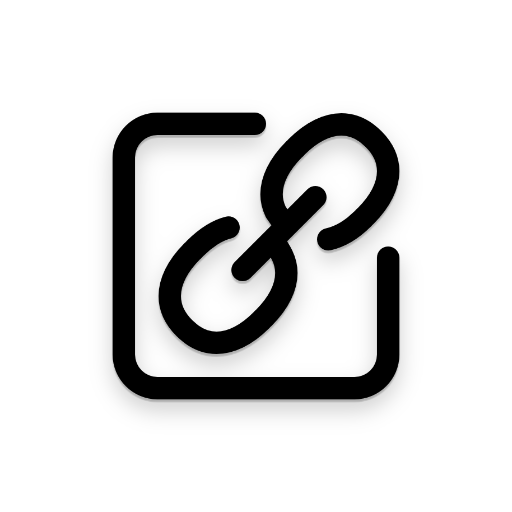
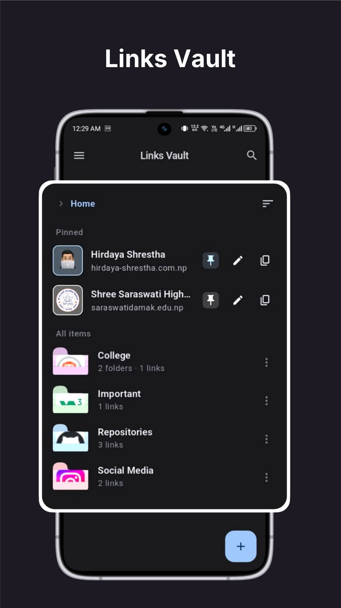
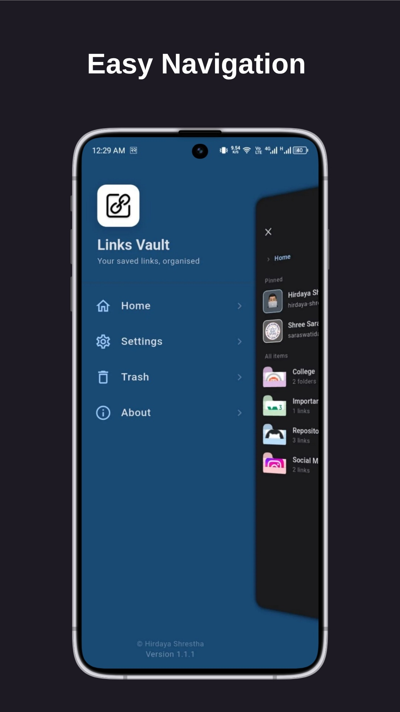
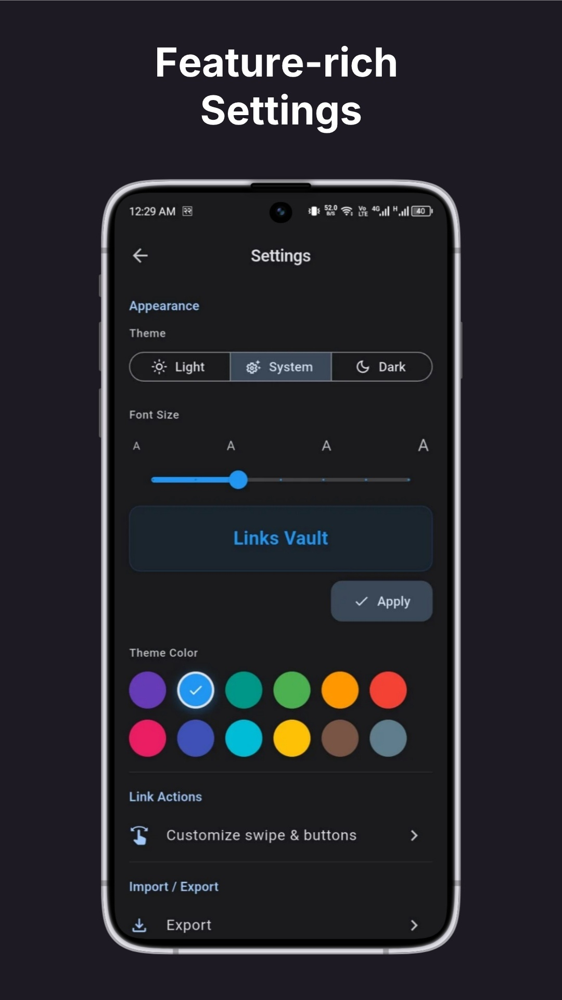
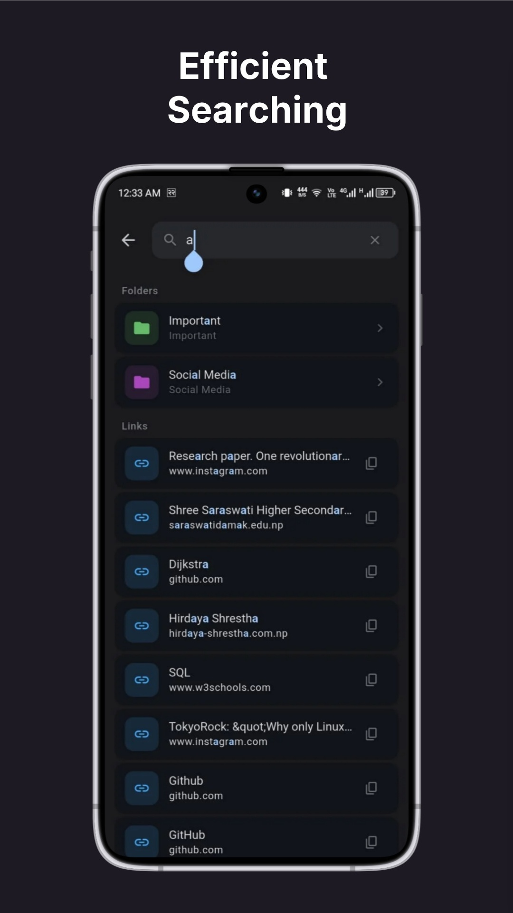
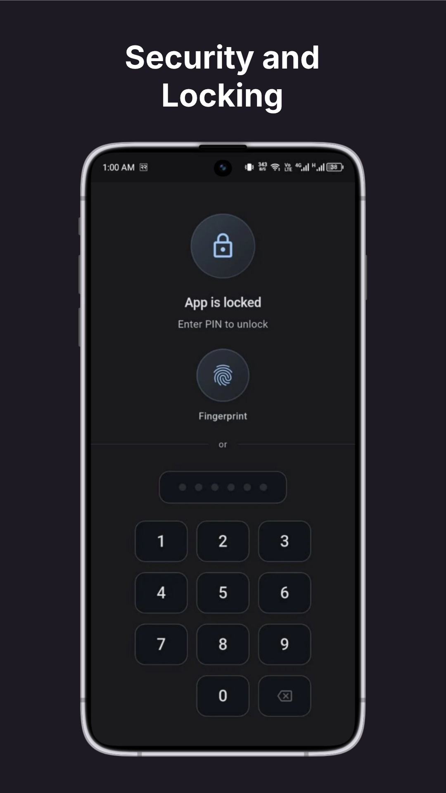

  
  <h1>Links Vault</h1>
  
<strong>Save, organize, and quickly access your important links — all offline.</strong>

  

    
    
    
    
    
  

---

## Screenshots

  
  
  
  
  

---

## About

**Links Vault** is a privacy-first Android app for saving and organizing your important links. Everything stays on your device — no account, no servers, no tracking.

Your data never leaves your phone.

---

## Features

| Feature | Description |
|---|---|
| **Everything offline** | Your links live on your phone — nowhere else. No account, no cloud. |
| **Nested folders** | Folders, subfolders, colours, pinning, and drag-to-reorder. |
| **Smart search** | Search by title or URL. Results appear as you type. |
| **PIN & biometric lock** | 4–6 digit PIN or fingerprint unlock. |
| **Custom themes** | 10 accent colours and adjustable font sizes. |
| **8 languages** | English, Nepali, Hindi, Chinese, Japanese, French, Spanish, German. |
| **Share to app** | Share from any app. Metadata auto-detected. |
| **QR code sharing** | Share links as QR codes. |
| **Import bookmarks** | Import browser bookmarks with ease. |
| **In-app browser** | Browse links without leaving the app. |

---

## Download

Latest version: **v1.2.1** — ~12 MB — Android 7.0+

---

## Privacy

Links Vault collects **zero data**. No telemetry, no analytics, no accounts. Every link, folder, and note stays exclusively on your device. Read the [Privacy Policy](https://hirdaya-shrestha.com.np/linksvault/privacy).

---

## License

This repository is for informational purposes only. The source code is not publicly available.

© 2026 [Hirdaya Shrestha](https://hirdaya-shrestha.com.np)
